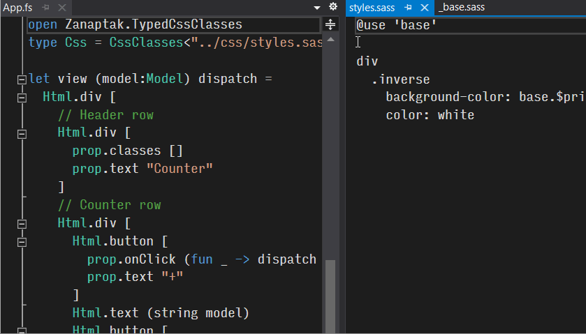

# TypedCssClasses Fable Sass Sample

This sample illustrates the following concepts:

* Using [TypedCssClasses](https://github.com/zanaptak/TypedCssClasses) for type-safe CSS class properties in a [Fable](https://fable.io/) single page application.

* Using the [Sass](https://sass-lang.com/) CSS preprocessor to generate CSS. The sample uses Sass syntax; SCSS syntax would also work with the same setup.

* Using [Feliz](https://github.com/Zaid-Ajaj/Feliz/) for type-safe HTML.

## Getting started

Install [.NET Core SDK](https://dotnet.microsoft.com/download).

Install [Node.js](https://nodejs.org/).

Run `dotnet restore`.

Run `npm install`.

Run `npm start`, and then browse to `http://localhost:8080`. You should get a counter with the header styled as white monospace text on blue background.

Optionally, run `npm run build` to produce a production deployment version.

## Project structure

* `src/App.fs`

  The application code, including the view code where type-safe CSS classes are used. The application uses [Elmish](https://elmish.github.io/elmish/) architecture.

  In the code, note the `type Css = CssClasses<...>` declaration for the TypedCssClasses type provider and the `Css`-prefixed CSS class properties.

* `content/styles.sass` and `content/_base.sass`

  The source Sass files that are used to generate the CSS.

* `sass-process.js`

  The Node-based script file executed by the TypedCssClasses type provider at design and compile time to preprocess the Sass source file into standard CSS, which is then used to generate the CSS class properties.

  This script is used instead of the Sass CLI in order to additionally communicate any referenced files (`_base.sass` in this case) to the type provider as files to watch for changes.

* `deploy/`

  The folder containing the final distributable output after running `npm run build`. You can look at the `style.[some hash value].css` file to see the final generated CSS, and you can open `index.html` in the browser to run the application.
