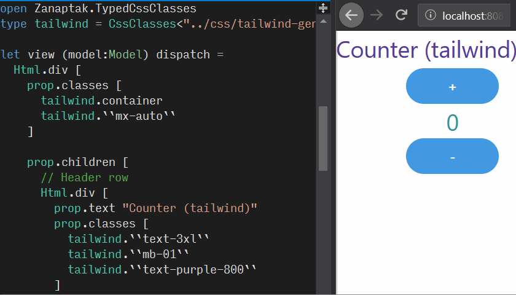

# TypedCssClasses Fable Tailwind Sample

This sample illustrates the following concepts:

* Using [TypedCssClasses](https://github.com/zanaptak/TypedCssClasses) for type-safe CSS class properties in a [Fable](https://fable.io/) single page application.

* Using a locally generated [Tailwind CSS](https://tailwindcss.com/) file with custom configuration options and extracted CSS components.

* Using Tailwind's [PurgeCSS](https://www.purgecss.com/) integration to [reduce the CSS bundle size](https://tailwindcss.com/docs/controlling-file-size). In this sample, it reduces from an initial minified size of about 590 KiB to a purged and minified size of about 6 KiB due to the small number of CSS classes referenced.

* Using [Feliz](https://github.com/Zaid-Ajaj/Feliz/) for type-safe HTML.

## Getting started

Install [.NET Core SDK](https://dotnet.microsoft.com/download).

Install [Node.js](https://nodejs.org/).

Run `dotnet restore`.

Run `npm install`.

Run `npm start`, and then browse to `http://localhost:8080`. You should get a counter with rounded blue buttons styled with Tailwind CSS.

Optionally, run `npm run build` to produce a production deployment version.

## Project structure

* `src/App.fs`

  The application code, including the view code where type-safe CSS classes are used. The application uses [Elmish](https://elmish.github.io/elmish/) architecture.

  In the code, note the `type tailwind = CssClasses<...>` declaration for the TypedCssClasses type provider and the `tailwind`-prefixed CSS class properties.

* `content/tailwind-source.css`

  The source CSS file that is used to generate the Tailwind utility classes as well as any custom CSS you have added. In this sample, custom CSS has been added for a rounded blue button style.

* `tailwind.config.js`

  The options file for configuring Tailwind customizations and purging.
  
  In this sample, the number of responsive screen breakpoints has been reduced from 4 to 1 in order to reduce the total number of CSS classes (more classes can result in slower IDE completion list performance). Also, some of the numeric values have been changed to be zero-padded. This improves sorting in completion lists, since numbers are sorted by leading character, so we get a sorted _01 02 03 ... 10 11 12_ list instead of a mixed _1 10 11 12 2 3 ..._ list.

  The purge option is configured to look at all `src/*.fs` and `content/*.html` files for strings matching the syntax characteristics of Tailwind class names to retain in the final bundle, purging all others.

* `tailwind-process.js`

  The Node-based script file executed by the TypedCssClasses type provider at design and compile time to process the Tailwind source file into standard CSS, which is then used to generate the CSS class properties.

  This script is used instead of the Tailwind CLI in order to additionally communicate any referenced files (`tailwind.config.js` in this case) to the type provider as files to watch for changes.

* `postcss.config.js`

  The file that configures PostCSS to run the Tailwind plugin during webpack builds.

* `deploy/`

  The folder containing the final distributable output after running `npm run build`. You can look at the `style.[some hash value].css` file to see the final purged and minified CSS, and you can open `index.html` in the browser to run the application.
